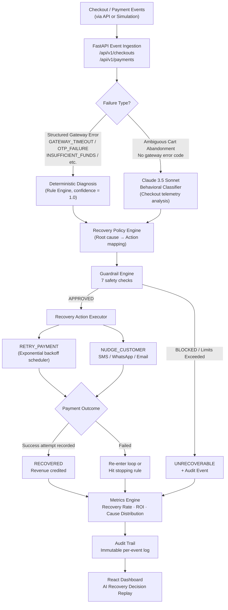

<div align="center">

# Recovr.ai

### AI-Powered Revenue Recovery for Failed Payments & Checkout Abandonment

[](https://github.com/mnataraj2006/recovr.ai/actions/workflows/ci.yml)
[](https://github.com/mnataraj2006/recovr.ai/actions)
[](https://python.org)
[](https://fastapi.tiangolo.com)
[](https://reactjs.org)
[](https://www.mongodb.com)
[](LICENSE)

**Built for the [Razorpay AI Buildathon](https://razorpay.com/buildathon/)**

</div>

---

> **Recovr.ai detects revenue at risk, diagnoses why a payment or checkout dropped off, selects a bounded recovery action, executes it, verifies actual recovery, and measures the revenue recovered.**

---

## Navigation

- [Problem Statement](#-problem)
- [Core Loop](#-core-recovery-loop)
- [Architecture](#-architecture)
- [AI Decisioning](#-ai-decisioning--where-it-is-and-where-it-isnt)
- [Recovery Policies](#-recovery-policy-table)
- [Safety & Guardrails](#-safe-by-design)
- [Recovery Decision Replay](#-recovery-decision-replay)
- [Metrics & Impact](#-metrics--measured-impact)
- [Testing](#-testing)
- [Security](#-security)
- [Tech Stack](#-tech-stack)
- [Project Structure](#-project-structure)
- [API Overview](#-api-overview)
- [Setup](#-local-development)
- [Demo](#-demo-walkthrough)

---

## 🏆 Hackathon Context

Recovr.ai is submitted to the **Razorpay AI Buildathon** under the **AI Revenue Recovery** track.

Failed payments and checkout abandonment represent real, quantifiable revenue that is at risk but not necessarily lost. The Razorpay ecosystem processes billions of INR in transactions daily — and a meaningful percentage of failures are recoverable if the right action is taken at the right time, for the right reason.

Recovr.ai answers: *what is the right action, why, when should automation stop, and how do you prove what was actually recovered?*

---

## 💸 Problem

Not all payment failures are equal.

| Failure Mode | Why it Happened | Wrong Response | Right Response |
|---|---|---|---|
| Gateway timeout | Transient network blip | Blame customer | Background auto-retry |
| Insufficient funds | Balance deficit | Retry (useless) | Alternate payment method nudge |
| OTP expired | Friction at authentication step | Do nothing | Re-authentication recovery link |
| Checkout abandoned | Price hesitation or UX friction | Generic email | Contextual incentive or shortcut |
| User cancelled | Intentional drop-off | Aggressive retry | Soft reminder with cart link |

A generic "payment failed → send a reminder" workflow misses this nuance entirely. Different root causes require different recovery strategies — and no strategy should run without limits.

The questions that must be answered for every failed transaction:

1. **What happened?** — Which event triggered the failure?
2. **Why did it happen?** — Structured gateway error or ambiguous customer behavior?
3. **What should happen next?** — Which recovery action maximises recovery probability?
4. **When should automation stop?** — Before annoying the customer or triggering card scheme penalties?
5. **Was money actually recovered?** — A recovery attempt is not the same as recovered revenue.

---

## 🔄 Core Recovery Loop

```
DETECT          →  Checkout created / payment attempted / payment failed / cart abandoned
    ↓
DIAGNOSE        →  Deterministic rule match OR Claude behavioral classifier
    ↓
DECIDE          →  Policy engine selects recovery action (RETRY_PAYMENT / NUDGE_CUSTOMER)
    ↓
GUARD           →  Guardrail engine validates action against safety limits
    ↓
ACT             →  Exponential backoff retry OR customer nudge dispatch
    ↓
VERIFY          →  Subsequent payment attempt outcome recorded (Success / Failed)
    ↓
MEASURE         →  Recovery rate, recovered revenue, ROI calculated from real payment data
    ↓
AUDIT           →  Immutable per-event audit trail for every decision and outcome
```

Each stage is a discrete module — independently tested, independently auditable.

---

## 🏗 Architecture



### MongoDB Collections

| Collection | Purpose |
|---|---|
| `transactions` | Core state machine (14 states, enforced transitions) |
| `checkouts` | Checkout session, cart, device telemetry |
| `customers` | Customer profile and contact |
| `payment_attempts` | Every payment attempt and gateway outcome |
| `diagnoses` | Root cause, confidence, source (rule/LLM), reasoning |
| `recovery_actions` | Proposed and executed recovery actions |
| `guardrail_decisions` | All guardrail evaluations with check-by-check results |
| `audit_events` | Immutable event log for every system action |
| `api_keys` | SHA-256 hashed API keys with status and revocation |
| `users` | User accounts with bcrypt hashed passwords |
| `simulation_cohorts` | Batch simulation run history |

---

## 🤖 AI Decisioning — Where It Is and Where It Isn't

This is the most important architectural decision in Recovr.ai.

### The Problem with Pure AI Control

Letting an AI model directly decide whether to retry a payment or send a customer nudge creates an unauditable, unbounded system. If the model hallucinates a wrong classification, the financial action follows. There is no stopping rule. There is no explainability.

### The Problem with Pure Rules

Deterministic rules handle structured gateway errors well (timeouts, OTP failures, declines). But cart abandonment has no error code. The reason a customer left without paying is a behavioral question — which is exactly what a language model is built to reason about.

### Recovr.ai's Hybrid Architecture

```
Structured gateway failure (error code present)
        ↓
Deterministic Rule Engine
(confidence = 1.0, fully auditable)
        ↓
Policy Engine → Guardrail Engine → Recovery Action

Ambiguous cart abandonment (no error code)
        ↓
Claude 3.5 Sonnet behavioral classifier
(checkout telemetry: cart value, duration, device info, history)
(constrained output schema: cause, confidence 0.0–1.0, reason)
        ↓
Policy Engine → Guardrail Engine → Recovery Action
```

**Claude is used for behavioral classification only.** It cannot directly trigger a payment retry, send a nudge, or modify any transaction state. Every classification output passes through the same deterministic policy and guardrail layer before any financial action is authorized.

**Why this matters:**
- Every recovery decision is explainable: the diagnosis source (rule or LLM), confidence, and reasoning are stored per-transaction.
- Claude's output is schema-validated against an enum of permitted diagnoses — hallucinated categories are rejected and fall back to `UNKNOWN_ABANDONMENT`.
- Financial actions are bounded by hardcoded limits that Claude cannot influence.

---

## 📋 Recovery Policy Table

Defined in [`backend/app/engines/policy/engine.py`](backend/app/engines/policy/engine.py):

| Root Cause | Diagnosis Source | Recovery Action | Channel | Guardrail |
|---|---|---|---|---|
| `GATEWAY_TIMEOUT` | Rule Engine | `RETRY_PAYMENT` | API Retry | Max 3 total failed attempts |
| `NETWORK_ERROR` | Rule Engine | `RETRY_PAYMENT` | API Retry | Max 3 total failed attempts |
| `INSUFFICIENT_FUNDS` | Rule Engine | `NUDGE_CUSTOMER` | WhatsApp | Max 1 nudge; 5 min cooldown |
| `OTP_FAILURE` | Rule Engine | `NUDGE_CUSTOMER` | SMS | Max 1 nudge; 5 min cooldown |
| `PAYMENT_CANCELLED` | Rule Engine | `NUDGE_CUSTOMER` | SMS | Max 1 nudge; 5 min cooldown |
| `PRICE_HESITATION` | Claude Classifier | `NUDGE_CUSTOMER` | Email | Max 2 nudges; 5 min cooldown |
| `UX_FRUSTRATION` | Claude Classifier | `NUDGE_CUSTOMER` | WhatsApp | Max 1 nudge; 5 min cooldown |
| `UNKNOWN_ABANDONMENT` | Claude / Fallback | `NUDGE_CUSTOMER` | SMS | Max 1 nudge; 5 min cooldown |

---

## 🛡 Safe by Design

Financial automation must have hard limits. Recovr.ai's **Guardrail Engine** runs 7 checks against every proposed recovery action before authorization:

| # | Check | What It Prevents |
|---|---|---|
| 1 | Transaction status validation | Actions on transactions not in `GUARDRAIL_CHECK` state |
| 2 | Duplicate payment protection | Double charges — blocks if checkout already has `SUCCESS`/`RECOVERED` payment |
| 3 | Retry limit | Retrying a card after 3 failed payment attempts (max 3) |
| 4 | Nudge limit | Over-messaging — max 1 nudge for most causes, max 2 for `PRICE_HESITATION` |
| 5 | Cooldown period | Sending nudges within 5 minutes of a previous nudge |
| 6 | Incentive cap | Discount coupons exceeding 10% of cart value or ₹500, whichever is lower |
| 7 | Action validity | Only `RETRY_PAYMENT` and `NUDGE_CUSTOMER` are permitted action types |

### Stopping Rule Flow

```
Retry Attempt 1  →  FAILED (GATEWAY_TIMEOUT)
        ↓
Retry Attempt 2  →  FAILED (GATEWAY_TIMEOUT)
        ↓
Retry Attempt 3  →  FAILED (GATEWAY_TIMEOUT)
        ↓
Guardrail Check: retry_limit  →  FAILED
        ↓
Action BLOCKED → Transaction → UNRECOVERABLE
        ↓
Audit Event: RECOVERY_ACTION_BLOCKED
        ↓
Recovered Revenue: ₹0
```

The system knows when to stop. It records why it stopped. It never retries beyond the limit.

Additionally:
- Exponential backoff with jitter (`min(60s, 10s × 2^attempt) ± 2s`) between retries
- Simulation data clearing is **blocked in production** at the API level
- Rate limiting on sensitive paths (auth, simulation, API keys) via `SecurityMiddleware`

---

## 🔍 Recovery Decision Replay

Every transaction in the Audit Logs page links to a dedicated **AI Recovery Decision Replay** view. This is not a CRUD details page — it is a full reconstruction of every automated decision made for that transaction.

**Access path:** Audit Logs → Click any transaction → Recovery Decision Replay

The replay surfaces (from live data, not cached):

- Transaction amount, customer, status, and checkout context
- Payment attempts count vs. guardrail limits
- AI diagnosis: classification, source (Rule Engine or Claude), confidence score, analyzed signals
- "Why did Recovr take this action?" — human-readable rationale from diagnosis + policy engine
- Guardrail evaluation: all 7 checks, passed/failed per check
- Expandable decision code block (full guardrail decision JSON)
- Vertical chronological audit timeline: every event from `CHECKOUT_CREATED` to terminal state

<!-- SCREENSHOT: Audit Logs — transaction table with View Replay column -->
<!-- SCREENSHOT: Recovery Decision Replay — AI diagnosis card + guardrail section + timeline -->

---

## 📊 Metrics & Measured Impact

`GET /api/v1/metrics` computes real metrics from live MongoDB data — not precomputed or cached.

### Computed Fields

| Metric | Formula |
|---|---|
| Revenue at Risk | Sum of amounts for transactions that had a failed payment attempt, were diagnosed, or received a recovery action |
| Recovered Revenue | Sum of amounts for `RECOVERED` transactions that have both a `Success` payment attempt AND were genuinely at-risk (not initial successes) |
| Transaction Recovery Rate | `Recovered Transactions / At-Risk Transactions` |
| Revenue Recovery Rate | `Recovered Revenue / Revenue at Risk` |
| Net Recovered Revenue | `Recovered Revenue − Total Recovery Cost` |
| ROI | `(Recovered Revenue − Total Recovery Cost) / Total Recovery Cost` |
| Recovery Cost | Retry: ₹1.00/attempt · WhatsApp/SMS: ₹0.50/nudge · Email: ₹0.10/nudge |

### Integrity Check

The metrics engine includes an `invalid_recovered_transactions` counter — transactions marked `RECOVERED` that do **not** have a verified `Success` payment attempt. This count should always be zero in a correct system. It is surfaced in the API to make integrity violations visible.

> **A recovery attempt is not the same as recovered revenue.** Recovr.ai counts recovered revenue only when a subsequent `Success` payment attempt is recorded against a transaction that was genuinely at risk. Normal initial successes are excluded.

### Run a Cohort Simulation

To generate metrics, run the batch cohort simulation from the dashboard or via API. This executes 5 deterministic profiles:

| Profile | Failure Mode | Expected Outcome |
|---|---|---|
| Transaction 1 | Initial success | `SUCCESS` (not at risk) |
| Transaction 2 | Gateway timeout → retry | `RECOVERED` |
| Transaction 3 | Repeated gateway timeouts | `UNRECOVERABLE` (guardrail blocks after 3 attempts) |
| Transaction 4 | Cart abandoned, customer does not return | `UNRECOVERABLE` |
| Transaction 5 | Cart abandoned, customer returns | `RECOVERED` |

---

## ✅ Testing

**Verified result — local run (2026-08-26):**

```
platform win32 -- Python 3.13, pytest-9.1.1
collected 53 items

tests/test_api_keys.py                    .      [  1%]
tests/test_authentication_rbac.py         ...    [  7%]
tests/test_database.py                    ...    [ 13%]
tests/test_diagnosis_policy.py            ..     [ 16%]
tests/test_final_correctness_invariants.py .......[ 30%]
tests/test_guardrails_scheduler.py        ........[ 45%]
tests/test_ingestion.py                   ..     [ 49%]
tests/test_metrics_guardrails_correction.py ....  [ 56%]
tests/test_metrics_simulation.py          ...    [ 62%]
tests/test_settings_and_users.py          ....   [ 69%]
tests/test_state_machine.py               ....   [ 77%]
tests/test_verification_scenarios.py      ...........[ 98%]
tests/test_webhook_security.py            .      [100%]

53 passed, 1 warning in 28.25s
```

**GitHub Actions — latest CI run on `main`:**

| Job | Status | Duration |
|---|---|---|
| Backend Pytest Invariant & Security Tests | ✅ PASS | ~50s |
| Frontend Typecheck & Production Build | ✅ PASS | ~19s |

### Notable Test Coverage

- **`test_final_correctness_invariants.py`** — Verifies that initial successes are never counted as recovered revenue; that invalid recovered transactions are reported; that recovery rate is bounded 0–1.
- **`test_guardrails_scheduler.py`** — Verifies retry cap enforcement, duplicate-charge protection, cooldown period, nudge limits, and exponential backoff behavior.
- **`test_verification_scenarios.py`** — End-to-end recovery flow verification: checkout → payment failure → diagnosis → policy → guardrail → execution → recovery result.
- **`test_authentication_rbac.py`** — JWT auth, RBAC role enforcement, and API key authentication across ADMIN/OPERATOR/VIEWER roles.
- **`test_state_machine.py`** — All valid and invalid state transitions enforced by the transaction state machine.

---

## 🔐 Security

| Control | Implementation |
|---|---|
| JWT authentication | HS256 tokens, configurable expiry, signed with `JWT_SECRET` |
| Password hashing | bcrypt via `passlib` — no plaintext passwords stored |
| API key hashing | SHA-256 — raw key shown once at creation, never stored |
| API key revocation | Instant revocation via `POST /api/v1/api-keys/{key_id}/revoke` |
| RBAC | Three roles: `ADMIN`, `OPERATOR`, `VIEWER` — enforced per-endpoint via `require_role()` |
| Dual auth | JWT Bearer token OR `X-API-Key` header — both resolve to the same principal |
| Rate limiting | Sliding-window per-IP rate limiting on auth, simulation, and API key endpoints |
| Request tracing | UUID correlation ID injected on every request via `SecurityMiddleware` |
| Audit logging | Every privileged action generates an immutable audit event in MongoDB |
| Production guard | Simulation data clearing blocked at API level in production environments |

> Recovr.ai is a hackathon prototype. It does not claim SOC 2, PCI DSS, or production compliance certification.

---

## 🧰 Tech Stack

| Layer | Technology |
|---|---|
| **Frontend** | React 18, TypeScript, Vite 8, Vanilla CSS |
| **Backend** | Python 3.11+, FastAPI 0.110+, Uvicorn |
| **Database** | MongoDB 6.0 (Motor async driver) |
| **AI / LLM** | Anthropic Claude 3.5 Sonnet (`claude-3-5-sonnet-20241022`) via `anthropic` SDK |
| **Authentication** | JWT (PyJWT), bcrypt (passlib), API key SHA-256 hashing |
| **Testing** | pytest, pytest-asyncio, httpx (ASGI transport) |
| **CI/CD** | GitHub Actions (parallel backend + frontend jobs, MongoDB 6.0 service container) |
| **Type Safety** | Pydantic v2 (backend), TypeScript strict mode (frontend) |

---

## 📁 Project Structure

```
recovr.ai/
├── .github/
│   └── workflows/
│       └── ci.yml                    # Parallel backend + frontend CI
│
├── backend/
│   ├── app/
│   │   ├── ai/
│   │   │   ├── client.py             # AsyncAnthropic client (mock-safe)
│   │   │   └── diagnosis.py          # Claude 3.5 Sonnet behavioral classifier
│   │   ├── api/
│   │   │   ├── dependencies.py       # JWT + API key auth, RBAC require_role()
│   │   │   └── routes/
│   │   │       ├── auth.py           # Login, /me, change-password
│   │   │       ├── checkouts.py      # Checkout creation and abandonment
│   │   │       ├── payments.py       # Payment creation and attempt
│   │   │       ├── recovery.py       # Manual recovery trigger endpoints
│   │   │       ├── metrics.py        # Revenue recovery KPIs
│   │   │       ├── audit.py          # Audit log list + transaction detail
│   │   │       ├── simulation.py     # Cohort batch simulation runner
│   │   │       ├── api_keys.py       # API key CRUD and revocation
│   │   │       ├── users.py          # User profile, notifications, team RBAC
│   │   │       └── health.py         # Health check endpoint
│   │   ├── audit/
│   │   │   └── logger.py             # Async audit event logger
│   │   ├── config/
│   │   │   └── settings.py           # Pydantic settings from environment
│   │   ├── db/
│   │   │   └── connection.py         # Motor MongoDB connection + index setup
│   │   ├── engines/
│   │   │   ├── diagnosis/
│   │   │   │   └── engine.py         # Rule → LLM dual-path diagnosis
│   │   │   ├── policy/
│   │   │   │   └── engine.py         # Root cause → recovery action mapping
│   │   │   ├── guardrails/
│   │   │   │   └── engine.py         # 7-check safety validation layer
│   │   │   └── scheduler/
│   │   │       └── engine.py         # Exponential backoff retry scheduler
│   │   ├── middleware.py             # Rate limiting + request correlation ID
│   │   ├── models/
│   │   │   ├── transaction.py        # State machine (14 states, valid transitions)
│   │   │   ├── checkout.py
│   │   │   ├── customer.py
│   │   │   └── audit.py
│   │   ├── services/
│   │   │   ├── auth_service.py       # JWT encode/decode, bcrypt, seed user
│   │   │   └── recovery_service.py   # Orchestrates Diagnose→Policy→Guard→Act
│   │   ├── simulation/
│   │   │   └── runner.py             # 5-profile deterministic cohort simulator
│   │   └── main.py                   # FastAPI app, lifespan, route registration
│   ├── tests/                        # 53 pytest tests across 13 modules
│   ├── requirements.txt
│   ├── pytest.ini
│   └── .env.example
│
├── frontend/
│   └── src/
│       ├── pages/
│       │   ├── Dashboard.tsx         # Revenue KPIs + simulation trigger
│       │   ├── Analytics.tsx         # Transaction charts and breakdowns
│       │   ├── AuditLogs.tsx         # Filterable audit log table
│       │   ├── TransactionDrillDown.tsx  # AI Recovery Decision Replay
│       │   └── settings/
│       │       ├── General.tsx       # Profile settings (persisted)
│       │       ├── Security.tsx      # Password change (persisted)
│       │       ├── Notifications.tsx # Notification preferences (persisted)
│       │       ├── Team.tsx          # Team RBAC management (persisted)
│       │       └── ApiKeys.tsx       # API key generation and revocation
│       ├── components/
│       ├── services/                 # authFetch wrapper, typed API calls
│       ├── types/                    # TypeScript interfaces for all models
│       └── context/
│           └── AuthContext.tsx       # JWT auth state management
│
└── docs/
    ├── architecture.md
    ├── api.md
    └── recovery-policy.md
```

---

## 🌐 API Overview

All routes are under `/api/v1`. Authentication required (JWT Bearer or `X-API-Key`) except `/health` and `/api/v1/auth/login`.

| Resource | Methods | Key Endpoints |
|---|---|---|
| **Auth** | POST, GET | `/auth/login`, `/auth/me`, `/auth/change-password` |
| **Users / Team** | GET, PATCH, POST, DELETE | `/users/me`, `/users/me/notifications`, `/users` |
| **API Keys** | GET, POST, POST, DELETE | `/api-keys`, `/api-keys/{id}/revoke` |
| **Checkouts** | POST | `/checkouts`, `/checkouts/{id}/abandon` |
| **Payments** | POST | `/payments/create`, `/payments/attempt` |
| **Recovery** | POST | `/recovery/diagnose`, `/recovery/policy`, `/recovery/guardrails`, `/recovery/execute` |
| **Metrics** | GET | `/metrics` |
| **Audit** | GET | `/transactions`, `/transactions/{id}/audit` |
| **Simulation** | POST, GET, DELETE | `/simulation/run`, `/simulation/history`, `/simulation/clear` |

Full API documentation: [`docs/api.md`](docs/api.md)

---

## 💻 Local Development

### Prerequisites

- Python 3.11+
- Node.js 20+
- MongoDB 6.0 (local or [MongoDB Atlas](https://www.mongodb.com/atlas))
- Anthropic API key (optional — falls back to deterministic rules without it)

### Setup

```bash
# 1. Clone
git clone https://github.com/mnataraj2006/recovr.ai.git
cd recovr.ai
```

```bash
# 2. Backend
cd backend
python -m venv venv
source venv/bin/activate        # Windows: venv\Scripts\activate
pip install -r requirements.txt
```

```bash
# 3. Environment
cp .env.example .env
# Edit .env — set MONGO_URI, JWT_SECRET, ANTHROPIC_API_KEY (optional)
```

```bash
# 4. Run Backend
uvicorn app.main:app --reload --port 8000
# Seed admin user is created automatically on first startup
# Default credentials: admin@recovr.ai / admin123
```

```bash
# 5. Run Frontend (separate terminal)
cd ../frontend
npm install
npm run dev
# Dashboard available at http://localhost:5173
```

```bash
# 6. Run Tests
cd backend
pytest --verbose
# Expected: 53 passed

# 7. Production Build (optional)
cd ../frontend
npm run build
```

### Environment Variables

| Variable | Description | Default |
|---|---|---|
| `MONGO_URI` | MongoDB connection string | `mongodb://localhost:27017` |
| `MONGO_DB` | Database name | `recovr_db` |
| `JWT_SECRET` | JWT signing key — **change in production** | — |
| `ANTHROPIC_API_KEY` | Claude API key (optional) | Falls back to deterministic |
| `ENVIRONMENT` | `development` / `production` | `development` |
| `PORT` | Backend port | `8000` |

---

## 🎬 Demo Walkthrough

Recommended demo sequence:

1. **Login** — `admin@recovr.ai` / `admin123`
2. **Dashboard** — View revenue at risk, recovered revenue, recovery rate
3. **Run Simulation** — Trigger the 5-profile cohort batch from the dashboard
4. **Watch Metrics Update** — KPIs recalculate from live data
5. **Audit Logs** — Open the transaction table; observe `RECOVERED` and `UNRECOVERABLE` rows
6. **Click a RECOVERED transaction** — Open the AI Recovery Decision Replay
   - View diagnosis: `GATEWAY_TIMEOUT` classified by Rule Engine, confidence 1.0
   - View policy: `RETRY_PAYMENT` via API retry with policy reasoning
   - View guardrails: all 7 checks listed as passed
   - View timeline: full chronological event sequence to `PAYMENT_RECOVERED`
7. **Click an UNRECOVERABLE transaction** — Observe the stopping rule
   - View guardrail: `retry_limit` check failed after 3 failed attempts
   - View `RECOVERY_ACTION_BLOCKED` event in timeline
   - Recovered Revenue: ₹0
8. **Settings → API Keys** — Generate and revoke a `sk_live_` key
9. **Settings → Team** — Invite a user with `OPERATOR` role

---

## 🗺 Roadmap

- Live Razorpay webhook integration (payment events trigger recovery in real-time)
- Real notification provider integration (Twilio SMS, Gupshup WhatsApp, SendGrid Email)
- Adaptive policy optimization (recovery strategy learned from historical outcomes)
- Multi-merchant support with isolated tenancy
- Production cloud deployment with auto-scaling

---

## 📄 Further Reading

- [`docs/architecture.md`](docs/architecture.md) — Full system architecture and database schema
- [`docs/api.md`](docs/api.md) — Complete API endpoint reference
- [`docs/recovery-policy.md`](docs/recovery-policy.md) — Recovery policy decision rationale

---

<div align="center">

**Recovr.ai doesn't just identify lost revenue. It attempts to recover it, knows when to stop, and proves what was actually recovered.**

Built for [Razorpay AI Buildathon](https://razorpay.com/buildathon/)

</div>
