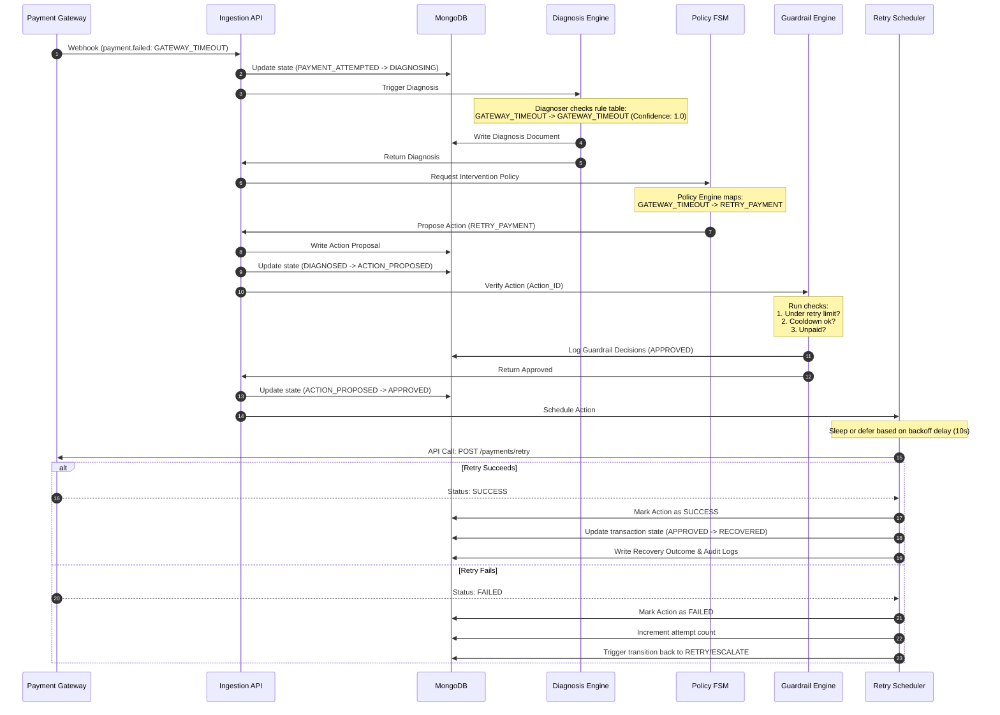

# Recovr.ai — Recovery Policy & Guardrails

This document defines the rules, actions, and protective boundaries of the Recovery Policy FSM and the Guardrail Engine.

---

## 1. The Recovery Policy Matrix

The Recovery Policy matches the diagnosed root cause of a failure or abandonment with a target intervention.

| Root Cause | Policy Action | Channel | Limit / Ceiling | Reasoning |
| :--- | :--- | :--- | :--- | :--- |
| **`GATEWAY_TIMEOUT`** | `RETRY_PAYMENT` | `API_RETRY` | Max 2 retries | Timeout is considered a transient gateway/network failure. Retrying the charge often succeeds once connectivity stabilizes. |
| **`NETWORK_ERROR`** | `RETRY_PAYMENT` | `API_RETRY` | Max 2 retries | Network packet loss or socket drops are transient. Background retries cause no user friction. |
| **`INSUFFICIENT_FUNDS`** | `NUDGE_CUSTOMER` | `WHATSAPP` | Max 1 nudge | The customer's primary account lacks balance. Nudging them to pay via an alternate method (different card or wallet) is appropriate. |
| **`OTP_FAILURE`** | `NUDGE_CUSTOMER` | `SMS` | Max 1 nudge | OTP timeouts or wrong codes are UX friction points. A direct link to restart authorization helps recover intent. |
| **`PAYMENT_CANCELLED`** | `NUDGE_CUSTOMER` | `SMS` | Max 1 nudge | Customer clicked cancel or aborted checkout during gateway redirects. A soft reminder recovers the cart if it was accidental. |
| **`PRICE_HESITATION`** | `NUDGE_CUSTOMER` | `EMAIL` | Max 2 nudges | Abandoned checkout without error. Spent high time reviewing. Suggest a cart reminder, with a small incentive (e.g. free shipping) on attempt 2. |
| **`UX_FRUSTRATION`** | `NUDGE_CUSTOMER` | `WHATSAPP` | Max 1 nudge | Customer encountered repeated validation errors or interface delay. Offer direct checkout links to bypass the standard flow. |

---

## 2. Retry Scheduler & Exponential Backoff

For background payment retries (`API_RETRY`), we use **Capped Exponential Backoff with Jitter** to ensure we don't overload gateway systems or banks.

### Delay Calculation

$$T_{\text{wait}} = \min\left(T_{\text{max}}, T_{\text{base}} \times 2^{\text{attempt}}\right) + \text{Jitter}$$

Where:
* $T_{\text{base}} = 10\text{ seconds}$
* $T_{\text{max}} = 60\text{ seconds}$
* $\text{Jitter} = \text{Random float between } [-2, +2]\text{ seconds}$

### Example Timeline for `GATEWAY_TIMEOUT`:
* **Attempt 1:** Waits $\approx 10\text{s} \pm 2\text{s}$ before trigger.
* **Attempt 2:** Waits $\approx 20\text{s} \pm 2\text{s}$ before trigger.
* **Attempt 3:** Exceeds maximum retries (2) $\rightarrow$ Marked as `UNRECOVERABLE`.

---

## 3. The Guardrail Engine Specifications

The Guardrail Engine acts as a gatekeeper. **Every proposed recovery action must pass through the Guardrail Engine before execution.** If any guardrail fails, the action is blocked, recorded as blocked, and the transaction is marked accordingly.

```text
                  Proposed Action
                        │
                        ▼
             ┌─────────────────────┐
             │ 1. Transaction Status Check
             │    - Is it in APPROVED state?
             └──────────┬──────────┘
                        ▼
             ┌─────────────────────┐
             │ 2. Already Paid Check
             │    - Is transaction already SUCCESS/RECOVERED?
             └──────────┬──────────┘
                        ▼
             ┌─────────────────────┐
             │ 3. Retry Limit Check
             │    - Has retry threshold been exceeded?
             └──────────┬──────────┘
                        ▼
             ┌─────────────────────┐
             │ 4. Nudge Limit Check
             │    - Has customer been contacted too many times?
             └──────────┬──────────┘
                        ▼
             ┌─────────────────────┐
             │ 5. Cooldown Check
             │    - Has enough time elapsed since last action?
             └──────────┬──────────┘
                        ▼
             ┌─────────────────────┐
             │ 6. Incentive Limit Check
             │    - Is discount/incentive below threshold?
             └──────────┬──────────┘
                        ▼
                  Action Approved
```

### Detailed Guardrail Rules

1. **Transaction Status Check:**
   * The transaction status must be `GUARDRAIL_CHECK` (or active recovery state). Terminal states (`SUCCESS`, `RECOVERED`, `UNRECOVERABLE`) reject any new actions.

2. **Already Completed Check:**
   * Query the transaction store to ensure no other payment attempts succeeded for this checkout. This prevents double-charging.

3. **Retry Limit Check:**
   * Limit type: `RETRY_PAYMENT`. Max value: 2.
   * If `payment_attempts` where status is `failed` count $\ge 2$, return `BLOCKED`.

4. **Nudge Limit Check:**
   * Limit type: `NUDGE_CUSTOMER`. Max value: 2 (depending on cause).
   * Checks the number of sent `recovery_actions` where status is `SUCCESS`. Prevents spam.

5. **Cooldown Check:**
   * Minimum time required between consecutive SMS/WhatsApp nudges is **300 seconds (5 minutes)**. If the last action was executed less than 5 minutes ago, block or defer the action.

6. **Incentive Limit Check:**
   * Incentives (discounts, coupon additions) cannot exceed **10%** of the original checkout cart value or a absolute cap of **₹500**. Any proposed action exceeding this limit is blocked and flagged as a security violation.

---

## 4. End-to-End Execution Sequence

This sequence diagram illustrates the lifecycle of a failed transaction transitioning from detection to recovery.


